# DAW1 Unidad 2 Práctica 2.2

**Autor**: Antonio Caro Benítez  
**Fecha**: 06/11/2024  
**Curso**: 1º DAW B  

---

## 2.1 Instalación de entornos de desarrollo, propietarios y libres

### Tarea Individual

**Instalación de Visual Studio (Propietario):**
1. Ve a la página oficial de [Visual Studio](https://visualstudio.microsoft.com/) y descarga la edición deseada.

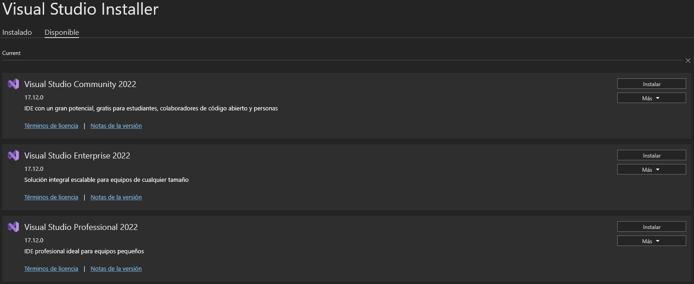
3. Inicia el instalador:
   - Selecciona los componentes de desarrollo necesarios (e.g., desarrollo web, aplicaciones de escritorio .NET, etc.).
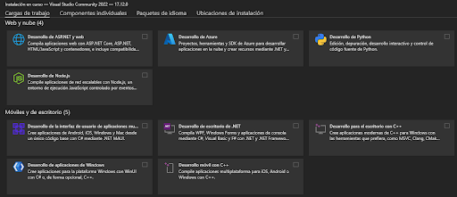
   - Descarga e instala los componentes.
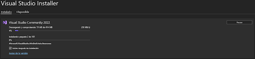
   - Completa la instalación y, si es necesario, inicia sesión con una cuenta de Microsoft.
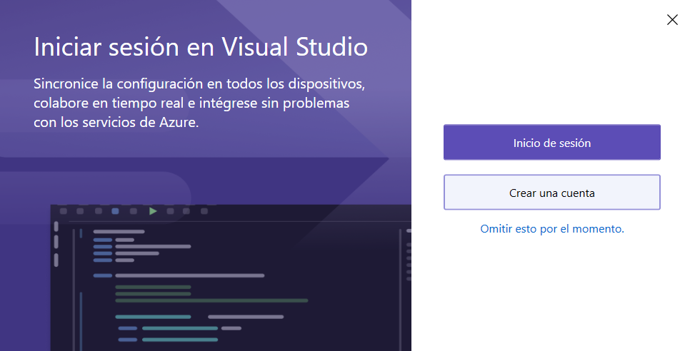

**Instalación de Visual Studio Code (Libre):**
1. Descarga el instalador desde la página oficial de [Visual Studio Code](https://code.visualstudio.com/).
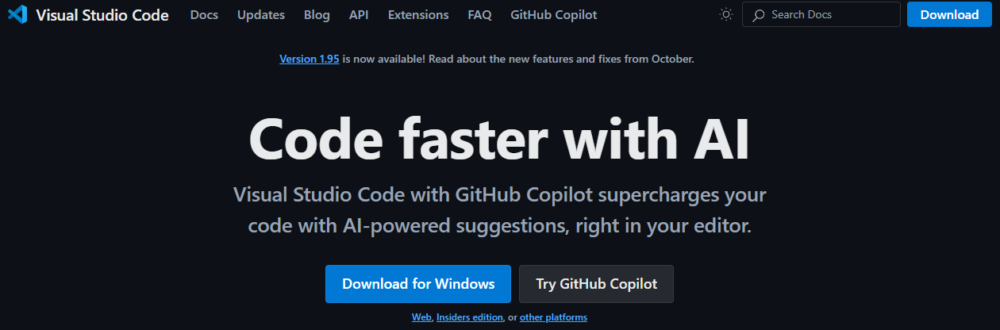
3. Abre el instalador y sigue los pasos:
   - Acepta los términos de licencia.
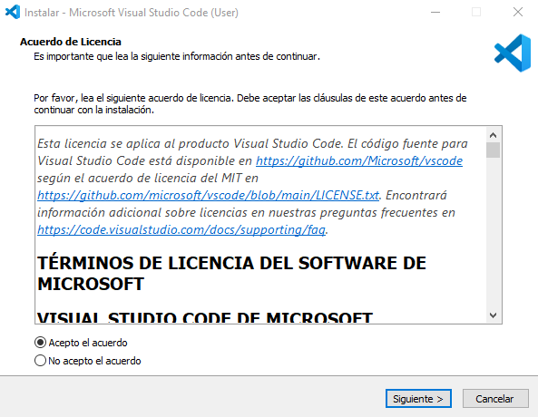
   - Elige el directorio de instalación.
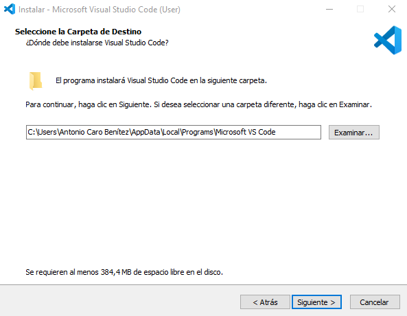
   - Selecciona opciones adicionales (e.g., habilitar desde la terminal).
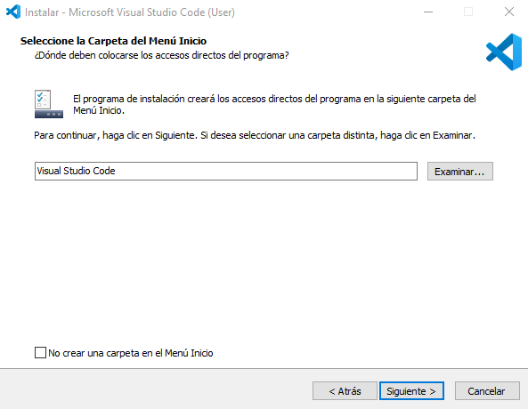
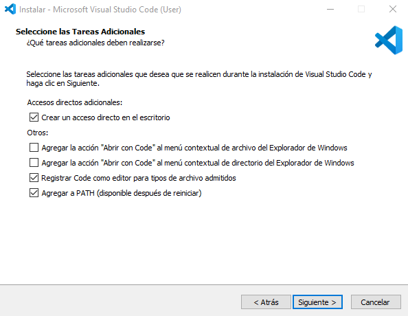
   - Completa la instalación.
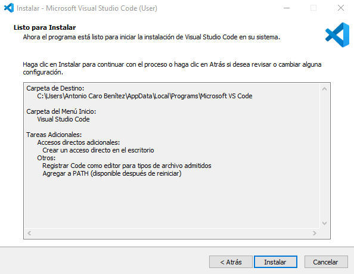

---

### Preguntas:

**1. Diferencias en el proceso de instalación:**
- **Tamaño y duración:** VS Code es más ligero y rápido de instalar. Visual Studio es más pesado y tarda más.
- **Opciones de configuración:** VS Code tiene menos configuraciones iniciales. Visual Studio requiere elegir paquetes de desarrollo.
- **Autenticación:** Visual Studio requiere una cuenta Microsoft; VS Code no.
- **Actualización:** VS Code se actualiza automáticamente y fácilmente. Visual Studio necesita mayor control manual.

**2. Ventajas de cada entorno:**

| Visual Studio (Propietario)          | Visual Studio Code (Libre)       |
|--------------------------------------|----------------------------------|
| Herramientas integradas avanzadas    | Ligero y rápido para proyectos pequeños |
| Componentes específicos para grandes proyectos | Extensiones personalizables y libres |
| Integración con servicios Microsoft  | Código abierto y sin costo      |

---

## 2.2 Gestión de módulos y extensiones en el entorno de desarrollo

**Instalación de módulos en Visual Studio:**
1. Ve a `Herramientas > Obtener Herramientas y características`.
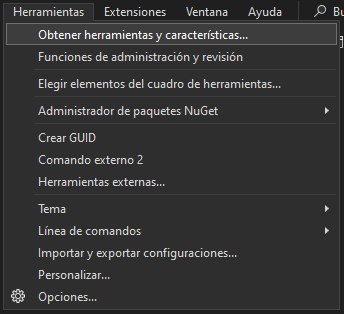
3. Busca módulos específicos (e.g., Desarrollo de Python).
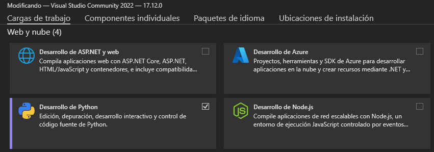
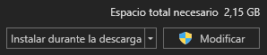
5. Instálalos y verifica con un nuevo proyecto.
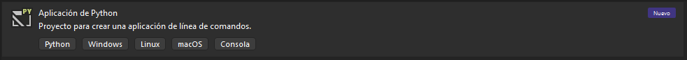
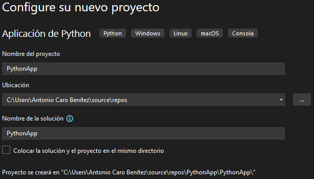
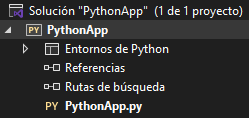

**Instalación de extensiones en Visual Studio Code:**
1. Abre el Marketplace (`Ctrl+Shift+X`).

3. Busca extensiones (e.g., Python) y haz clic en `Instalar`.
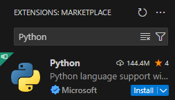
5. Verifica la activación con un archivo relacionado.
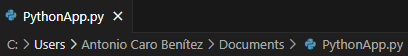

**Beneficios de extensiones instaladas:**
- **Visual Studio:** Administración de paquetes y depuración avanzada para Python.
- **VS Code:** Autocompletado, análisis de código y formato automático.

---

## 2.3 Personalización y automatización del entorno

### Personalización

| **Visual Studio (Propietario)**       | **Visual Studio Code (Libre)**   |
|--------------------------------------|----------------------------------|
| Tema: `Herramientas > Opciones`       | Tema: `Archivo > Preferencias`   |
| Atajos: Configura desde `Herramientas`| Atajos: Configura en `Ctrl+K Ctrl+S` |

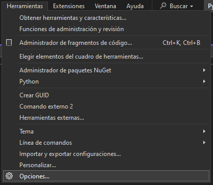

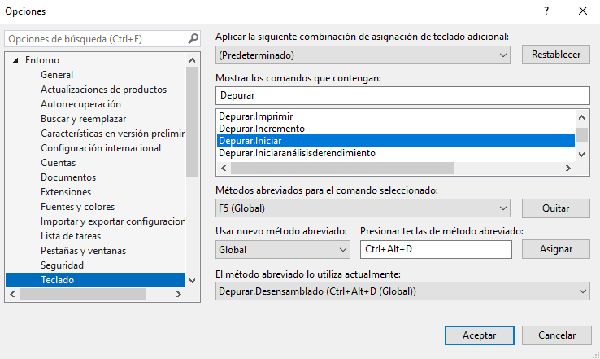
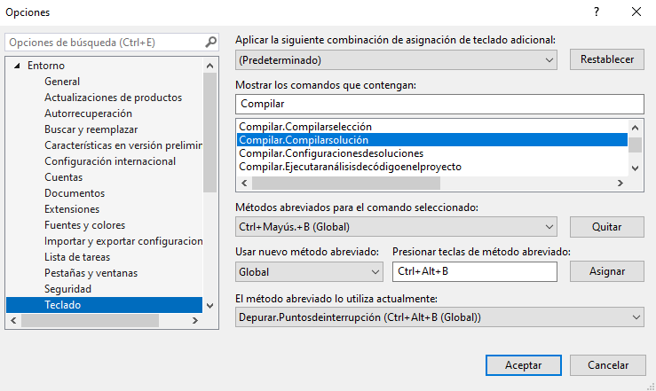

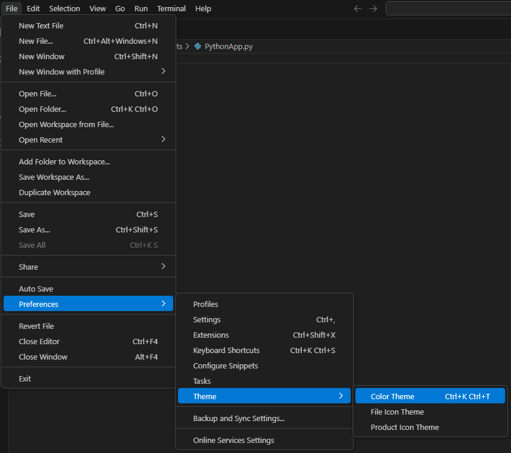
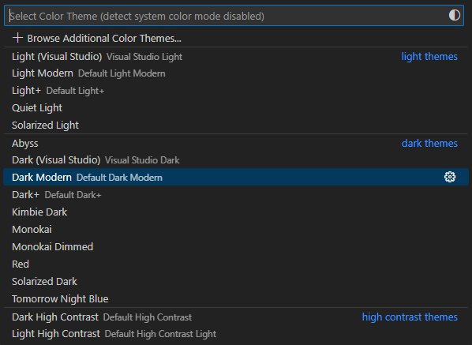
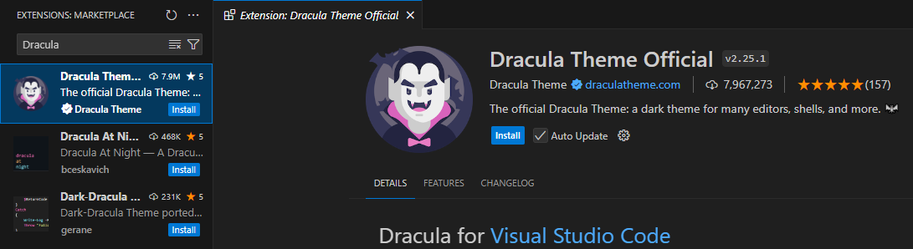
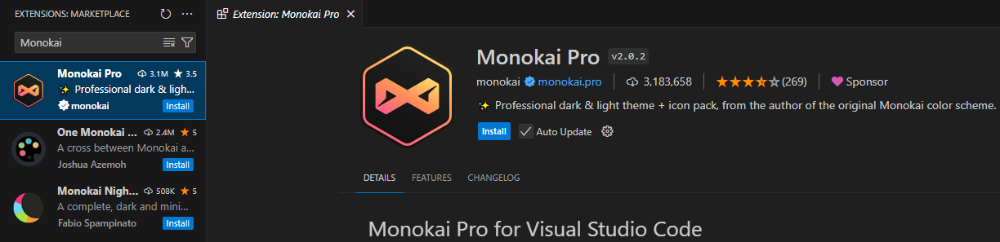

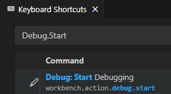
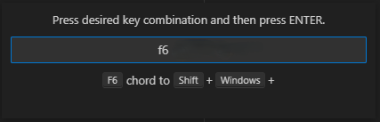
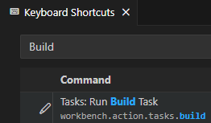

### Automatización

- **Visual Studio:** Configura compilación automática desde `Compilar > Administrador de configuración`.
- **VS Code:** Automatización con `tasks.json` para ejecutar pruebas con pytest.

---

## 2.4 Configuración del sistema de actualización

**Visual Studio:**
1. Ve a `Ayuda > Buscar actualizaciones`.
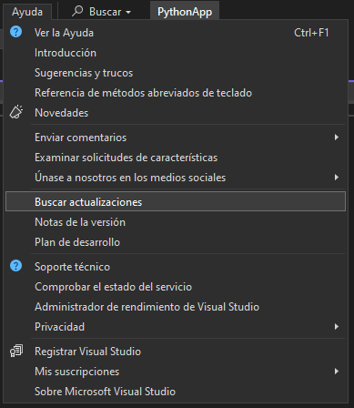
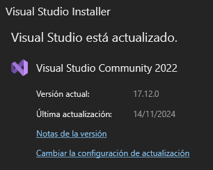
3. Configura actualizaciones automáticas desde `Herramientas > Opciones`.
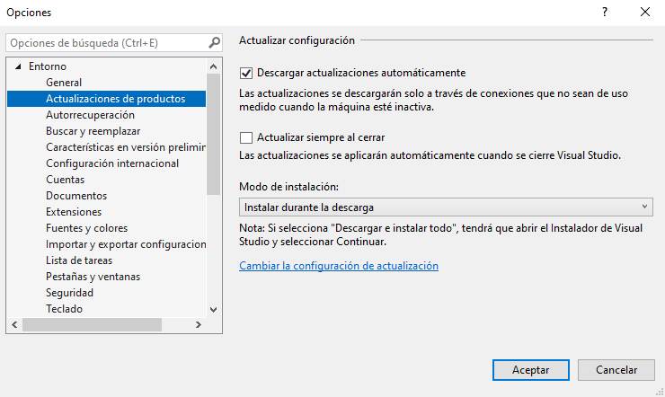

**Visual Studio Code:**
1. Configura `Update: Mode` en `default` o `start` desde `Archivo > Preferencias`.
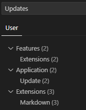
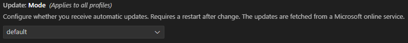
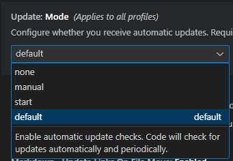

**Importancia de actualizaciones:**
- Seguridad.
- Compatibilidad con bibliotecas y frameworks.
- Nuevas funciones y mejoras.

---

## 2.5 Generación de ejecutables a partir de código fuente

### Configuración de Visual Studio Code para Java y Python:
1. Instala extensiones necesarias: `Java Extension Pack` y `Python`.
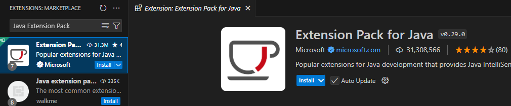

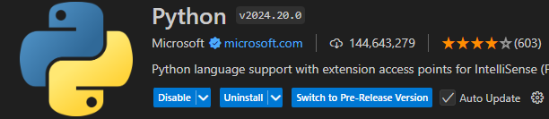
3. Asegúrate de tener un JDK para Java.

**Ejecución de código:**
- Java: Usa `javac` y `java`.

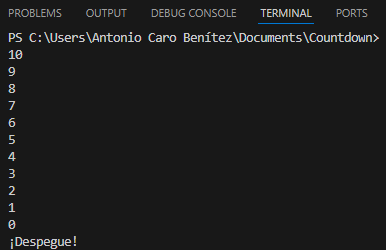
- Python: Usa `python <archivo>.py`.
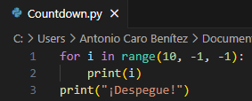
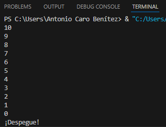

**Diferencias en generación:**
- Java genera bytecode `.class`.
- Python no requiere compilación, solo interpretación directa.

---

## 2.6 Generación de ejecutables en diferentes IDEs

### Comparación entre IDEs:
| **Visual Studio**                    | **Visual Studio Code**           |
|--------------------------------------|----------------------------------|
| Requiere crear un proyecto específico | Reconoce automáticamente archivos |
| Herramientas avanzadas para grandes proyectos | Ligero y eficiente para scripts pequeños |

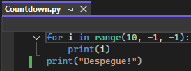
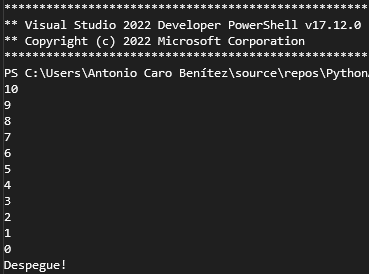

**Preferencia:**  
Visual Studio Code es más eficiente para scripts pequeños debido a su simplicidad y rapidez.

---
